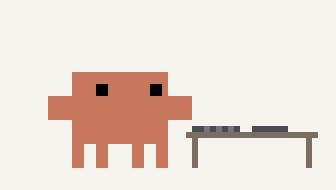
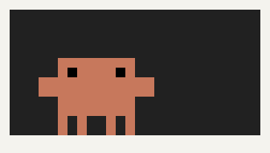
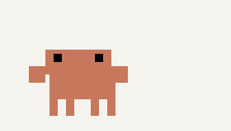
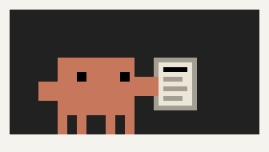
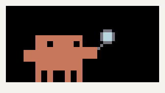
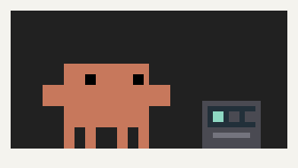
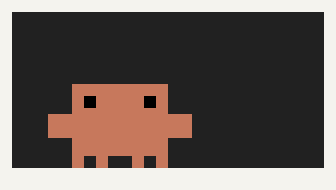
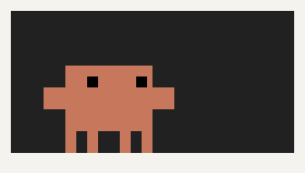
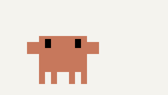
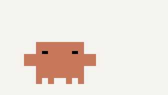

# Claudeagotchi

A tiny orange pixel companion that lives in the band above the prompt in Claude Code and acts out what Claude is actually doing. When Claude writes code, he sits down at his little computer and types.



He is a native Claude Code mod: a plugin of function hooks. He only watches. Every hook passes its event on unchanged and returns exactly what Claude Code answered, so tools, results and permissions are never touched. He uses no network and animates locally from built-in pixel art. He makes no model calls, except one when you confirm a handoff (see below).

## What he does

| | State | When |
| --- | --- | --- |
|  | **Idle** | Nothing is running. He blinks, glances around and bobs, on irregular timing. |
|  | **Thinking** | A prompt is being worked on but no tool is running (the model is generating), or a subagent is still at work, including one sent to the background. |
|  | **Coding** | `Edit`, `Write`, `MultiEdit`, `NotebookEdit`, or a shell command that writes a file (`>`, `tee`, `sed -i`, `patch`). The computer pops up, he types, nods, pauses to read the screen, then packs it away. A quick edit still gets about four seconds of typing. |
|  | **Reading** | `Read`, `WebFetch`, and read-only shell commands (`cat`, `head`, `ls`, `git diff`, ...). |
|  | **Searching** | `Grep`, `Glob`, `WebSearch`, `ToolSearch`, and `grep`/`rg`/`find` in the shell. |
|  | **Running** | Other shell commands. He watches a little build box and taps a foot. |
|  | **Success** | Only after a build, test, lint or type-check command (`npm test`, `pytest`, `cargo build`, `tsc`, `make`, ...) actually runs and exits successfully, with nothing such as a pipe, `\|\| true` or a later command deciding the result. Runs sent to the background don't count. One hop, then back to work. |
|  | **Needs attention** | A permission dialog is open, Claude is asking you a question (`AskUserQuestion`), a plan waits for approval, or an MCP server asks for input. He raises an arm and waves until it's answered. |
|  | **Error** | A build, test or check command runs and fails, or a turn dies on an API error or refusal. A command you decline, a blocked command or an interrupted one is no failure. A brief startle, then a puzzled scratch of the head, then back to whatever is happening. |
|  | **Resting** | Three quiet minutes. He sits down, closes his eyes and breathes. Any activity wakes him with a stretch. |

## Cache countdown and handoff

At the right end of his band is a small button showing how long the conversation's prompt cache stays warm: `● 47m`, `0:42` in the last minute, `◌ Cold` after. The ring empties as the time runs down, and the label turns red in the last fifth. It restarts on every request the main conversation sends to the model, including each step of a reply that uses tools. While the cache is warm, your next message is read from it cheaply. Once it's cold, the next message writes the whole conversation to the cache again, which costs more and counts more against your usage.

Click the button to show **Hand off to a fresh session** under it, and click it again to hide it. After you confirm "Start fresh with handoff?", he asks Claude for a handoff brief of this conversation (goal, what's done, current state, open issues, next steps, key files and decisions). He then clears the conversation with `/clear` and sends the brief as the first message of the new one. The brief is written over the conversation's own cached prompt, so it's cheap while the cache is warm. If the brief can't be written, nothing is cleared. If `/clear` can't run, the brief is left in your prompt box to send yourself. The handoff button waits while Claude is working.

**Which TTL.** The cache lasts 5 minutes or 1 hour after each request. He reads which one your setup uses from the session's transcript, where the API records how many tokens each request wrote at either TTL, and remembers it for next time. Before any transcript has said, he assumes 5 minutes. `/pet cache 5m` or `/pet cache 1h` sets it yourself. `/pet cache auto` goes back to the transcript.

The countdown is an estimate from your side. The service can drop a cache entry early, so treat **COLD** as certain and the time left as an upper bound. Subagents cache their own prompts, so their requests don't reset it.

The cache timing follows the [Cache TTL Timer](https://github.com/WQGGSEY/cache-ttl-timer) mod by Seongje Hong (MIT).

## How states change

Attention and errors interrupt anything immediately. Other changes wait out a short minimum (no flicker during bursts of quick tool calls), except that moving *up* to typing is always immediate. A turn simply ending is never treated as success.

## Install (permanent)

Run these two commands once, in any terminal:

```sh
claude plugin marketplace add https://github.com/ford41b/for-claude-to-work-on.git#claudeagotchi
claude plugin install claudeagotchi@claudeagotchi
```

This installs at user scope, so he loads in every new Claude Code session. Start a new session in the desktop app's Code tab (or restart the app) to see him above the prompt. No slash command is needed.

## Use

| Command | Does |
| --- | --- |
| `/pet` | Show or hide him. The choice is remembered across sessions. |
| `/pet off` · `/pet on` | Hide or show explicitly. |
| `/pet panel` | Show or hide the handoff row, same as the countdown button. |
| `/pet cache` | The cache's TTL and where it came from, time since the last request, and time left. `/pet cache 5m`, `/pet cache 1h` or `/pet cache auto` sets the TTL, remembered across sessions. |
| `/pet motion` | Toggle reduced motion: still, recognizable poses instead of animation. Remembered. |
| `/pet preview` | Play every state in turn (about a minute) without any real work. Run it again to stop. |
| `/pet status` | What he's doing and how he's set. |

While hidden, he draws nothing. A once-a-second check still keeps the cache countdown current, and it only redraws when the label changes.

## Uninstall

```sh
claude plugin uninstall claudeagotchi@claudeagotchi
claude plugin marketplace remove claudeagotchi
```

To keep him installed but off, use `/pet off`, or `claude plugin disable claudeagotchi@claudeagotchi`.

## Limitations

- **Where he shows.** In the desktop app's Code tab. The band above the prompt exists in the terminal and the desktop app, and the terminal can't draw vector art, so in a terminal he loads but draws nothing. Other mods' rows in the band are kept and drawn below him.
- **One session each.** Every session has its own companion, following only its own activity, subagents included. `/pet` and `/pet motion` apply to the session you type them in right away, and to other sessions the next time they start.
- **Guesses from shell commands.** Whether a shell command is coding, reading, searching or a test is judged from its text, not its effect. A test command's exit code decides success or failure. An interrupted command is neither.
- **Permission dialogs.** Claude Code reports when a dialog opens but not the moment you approve it. So after you approve a command he keeps his arm up until that command finishes, is denied, or the turn ends. He never drops it while you might still need to answer. In Auto mode, calls the classifier decides never show a dialog, so he doesn't raise his arm for them.
- **Clicking him.** The app shows his drawing as a picture that can't be clicked, so the handoff opens from the countdown button instead.
- **Reading the transcript.** To learn the TTL, he reads the end of the session's transcript (`~/.claude/projects/...`) with `tail`, looking only at timestamps and cache token counts. On Windows, where `tail` isn't available, he uses the TTL he last saw, or 5 minutes, and `/pet cache` sets it.
- **Success is narrow on purpose.** He only celebrates a build, test or check that passed. Answers, edits and ordinary commands earn no hop.

## Development

```sh
claude plugin validate .   # manifest, hooks and state contract
claude plugin test .       # simulated sessions: every state, priorities, timing, /pet
```

`hooks/sprites.ts` holds the artwork: every pose is drawn on a 52×26 pixel grid (3 CSS px per pixel) and assembled into an SVG whose frames are switched by SMIL, so the animation runs in the app without the plugin redrawing. `hooks/machine.ts` decides the state from activity. `hooks/cache.ts` times the prompt cache. `hooks/register.tsx` connects Claude Code's events and draws the band.

To try local changes without installing, run `claude --plugin-dir /path/to/this/folder`.
